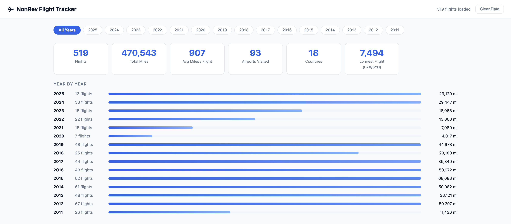
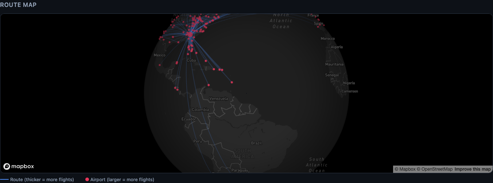

# NonRev Flight Explorer

[nonrevexplorer.app](https://nonrevexplorer.app) is an interactive web app for airline employees and their pass riders to calculate the total miles flown using non-rev travel benefits.

Upload your flight history CSV or Excel file and instantly see total miles flown, year-by-year breakdowns, a world route map, and a full searchable flight log — all without your data ever leaving your browser.

> **Airline compatibility:** This app should work with any airline's non-rev history export as long as it contains a route column formatted as `AAA/BBB` (IATA origin/destination). Other column names like `Date` and flight number are auto-detected where possible.

---

## Screenshots





---

## Features

- **Drag-and-drop upload** — CSV or Excel (.xlsx) non-rev history export
- **Distance calculation** — great-circle miles and kilometers for every route
- **Stats dashboard** — total flights, total miles, unique airports, countries visited, longest flight, and more
- **Year-by-year breakdown** — filter by any year to see annual totals
- **Route map** — interactive world map with great-circle arcs; thicker lines and larger dots indicate more frequently flown routes
- **Flight log** — full sortable table of every flight with date, route, flight number, priority, and distance
- **100% private** — no data is uploaded, stored, or transmitted; everything runs in your browser and is cleared when you close the tab

---

## Using the App

### 1. Export your flight history

Export your non-rev flight history from your airline's employee portal as a CSV or Excel file.

### 2. Upload your file

Drop the file onto the upload zone or click to browse. The app auto-detects columns by name, so it will work even if your export has extra columns or the columns aren't labeled. At minimum, a `Route` column with values like `ATL/DTW` is required.

**Supported columns** (all optional except Route):

| Column | Description |
|---|---|
| `Route` | Origin/destination in `AAA/BBB` format — **required** |
| `Date` | Flight date (`M/D/YYYY` or `YYYY-MM-DD`) |
| `DL Flight No` | Flight number |
| `Priority` | Non-rev priority class (e.g. `S2`, `S3`) |

### 3. Explore your results

- Use the **year filter** at the top to drill into a specific year
- Click any **column header** in the flight log to sort
- Click **airport dots** on the map for details
- Click **Clear Data** in the header when you're done — this wipes all data from memory immediately

---

## Privacy

This app is designed to be safe to share with colleagues.

- Your CSV is parsed **entirely in your browser** using JavaScript — no server is involved
- Personal information (names, employee IDs) is **discarded immediately** during parsing and never stored in memory
- No cookies, no local storage, no analytics, no third-party tracking
- Flight data is cleared automatically when you close or refresh the tab
- The only external requests are map tile images from [CARTO](https://carto.com) — these contain no user data

---

## Airport Database

The app includes coordinates for ~400 airports worldwide, covering major domestic and international routes. If a route contains an airport not in the database, the distance will show as `—` but the flight will still appear in the log and on the map.

To report a missing airport, open an issue with the IATA code and airport name.

---

## Running Locally

Requires [Node.js](https://nodejs.org) 18+.

```bash
# Install dependencies
npm install

# Start development server
npm run dev
```

Open [http://localhost:5173](http://localhost:5173) in your browser.

```bash
# Build for production
npm run build

# Preview the production build
npm run preview
```

---

## Tech Stack

- [React](https://react.dev) + [Vite](https://vitejs.dev)
- [Leaflet](https://leafletjs.com) + [React Leaflet](https://react-leaflet.js.org) for the route map
- [PapaParse](https://www.papaparse.com) for CSV parsing
- [CARTO](https://carto.com) dark map tiles
